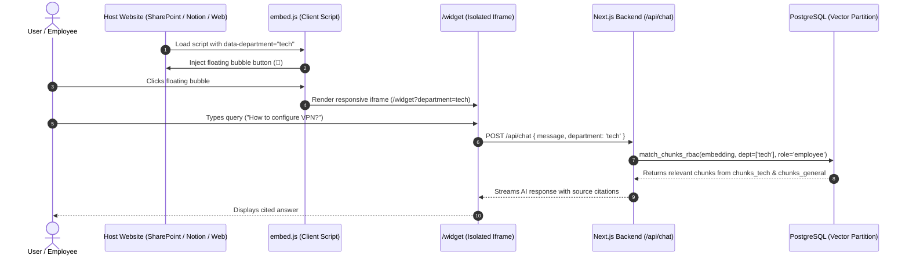

# Enterprise Chat Widget: Setup & Platform Integration Guide

> **Document Version:** 2.0  
> **Status:** Official Integration Reference  
> **Target Audience:** Frontend Engineers, Webmasters, IT Administrators, SharePoint/Notion Managers, and Support Operations  

---

## Table of Contents
1. [Overview & How It Works](#1-overview--how-it-works)
2. [Script Attributes Reference](#2-script-attributes-reference)
3. [Department-Specific Data Isolation & Security](#3-department-specific-data-isolation--security)
4. [Step-by-Step Platform Integration Tutorials](#4-step-by-step-platform-integration-tutorials)
   - [4.1 Plain HTML / Static Websites](#41-plain-html--static-websites)
   - [4.2 Next.js (App & Pages Router)](#42-nextjs-app--pages-router)
   - [4.3 React (SPA / Vite)](#43-react-spa--vite)
   - [4.4 Vue.js & Nuxt](#44-vuejs--nuxt)
   - [4.5 Angular Applications](#45-angular-applications)
   - [4.6 Microsoft SharePoint Online](#46-microsoft-sharepoint-online)
   - [4.7 Atlassian Confluence](#47-atlassian-confluence)
   - [4.8 Notion Workspaces (Direct Iframe Embed)](#48-notion-workspaces-direct-iframe-embed)
   - [4.9 WordPress & WooCommerce](#49-wordpress--woocommerce)
   - [4.10 Webflow & Framer](#410-webflow--framer)
   - [4.11 Zendesk & Freshdesk Help Centers](#411-zendesk--freshdesk-help-centers)
   - [4.12 Shopify](#412-shopify)
5. [Advanced Customization & JavaScript API](#5-advanced-customization--javascript-api)
6. [Content Security Policy (CSP) & Troubleshooting](#6-content-security-policy-csp--troubleshooting)
7. [Clarifying Questions for Next Phase](#7-clarifying-questions--next-steps)

---

# 1. Overview & How It Works

The **Enterprise Chat Widget** allows you to embed a department-scoped, AI-powered knowledge assistant into any website or intranet with a single line of JavaScript.



---

# 2. Script Attributes Reference

The widget is initialized using standard HTML `data-*` attributes:

```html
<script
  src="https://your-chatbot-domain.com/embed.js"
  data-department="tech"
  data-title="Tech Knowledge Base"
  data-primary-color="#6366f1"
  defer>
</script>
```

| Attribute | Required | Default | Description |
| :--- | :---: | :---: | :--- |
| `src` | **Yes** | — | Absolute URL pointing to `embed.js` hosted on your RAG deployment. |
| `data-department` | No | `"general"` | Target department partition (`general`, `marketing`, `finance`, `sales`, `operations`, `hr`, `tech`, `admin`). |
| `data-title` | No | `"Company Assistant"` | Header title displayed inside the floating chat window. |
| `data-primary-color`| No | `"#3b82f6"` | Primary brand hex color for the floating bubble and widget header. |
| `defer` | **Yes** | — | Ensures the script loads asynchronously without blocking page rendering. |

---

# 3. Department-Specific Data Isolation & Security

When a widget is configured with a specific department (e.g. `data-department="finance"`):

1. **Physical Partition Scoping:** The PostgreSQL engine prunes all partition tables belonging to other departments (`chunks_marketing`, `chunks_sales`, `chunks_hr`, `chunks_tech`, `chunks_admin`).
2. **Universal General Access:** The widget searches **only** the specified partition (`chunks_finance`) **plus** the universal `chunks_general` partition.
3. **Clearance Restriction:** All widget requests are enforced with `minimum_role = 'employee'`. Executive-level manager/admin documents inside that department partition remain protected.
4. **Domain Whitelisting:** If configured in `/dashboard/settings`, the widget will reject embedding attempts originating from unapproved host domains.

---

# 4. Step-by-Step Platform Integration Tutorials

---

### 4.1 Plain HTML / Static Websites
*(Apache, Nginx, GitHub Pages, Netlify, Vercel Static)*

Paste the `<script>` tag immediately before the closing `</body>` tag of your HTML pages:

```html
<!DOCTYPE html>
<html lang="en">
<head>
  <meta charset="UTF-8">
  <title>Company Portal</title>
</head>
<body>
  <h1>Welcome to Tech Portal</h1>
  
  <!-- Enterprise Chat Widget -->
  <script
    src="https://your-chatbot-domain.com/embed.js"
    data-department="tech"
    data-title="IT Help Desk"
    data-primary-color="#4f46e5"
    defer>
  </script>
</body>
</html>
```

---

### 4.2 Next.js (App & Pages Router)

#### App Router (`app/layout.tsx`):
Use Next.js's optimized `next/script` component:

```tsx
import Script from 'next/script';

export default function RootLayout({ children }: { children: React.ReactNode }) {
  return (
    <html lang="en">
      <body>
        {children}
        
        {/* Chat Widget Script */}
        <Script
          src="https://your-chatbot-domain.com/embed.js"
          strategy="lazyOnload"
          data-department="sales"
          data-title="Sales AI Assistant"
          data-primary-color="#3b82f6"
        />
      </body>
    </html>
  );
}
```

---

### 4.3 React (SPA / Vite)

Add the script inside `index.html` or mount it programmatically in `App.tsx`:

```tsx
import { useEffect } from 'react';

export default function App() {
  useEffect(() => {
    const script = document.createElement('script');
    script.src = 'https://your-chatbot-domain.com/embed.js';
    script.setAttribute('data-department', 'hr');
    script.setAttribute('data-title', 'HR & Benefits Assistant');
    script.setAttribute('data-primary-color', '#10b981');
    script.defer = true;
    document.body.appendChild(script);

    return () => {
      // Clean up bubble on unmount
      const bubble = document.getElementById('rag-chatbot-bubble');
      const iframe = document.getElementById('rag-chatbot-iframe-container');
      bubble?.remove();
      iframe?.remove();
    };
  }, []);

  return <div className="app"><h1>HR Intranet</h1></div>;
}
```

---

### 4.4 Vue.js & Nuxt

#### Nuxt 3 (`nuxt.config.ts`):
```ts
export default defineNuxtConfig({
  app: {
    head: {
      script: [
        {
          src: 'https://your-chatbot-domain.com/embed.js',
          'data-department': 'operations',
          'data-title': 'Operations Wiki',
          'data-primary-color': '#f59e0b',
          defer: true
        }
      ]
    }
  }
});
```

---

### 4.5 Angular Applications

In `src/index.html`:
```html
<!doctype html>
<html lang="en">
<head>
  <meta charset="utf-8">
  <title>CorporateApp</title>
</head>
<body>
  <app-root></app-root>
  
  <script
    src="https://your-chatbot-domain.com/embed.js"
    data-department="tech"
    data-title="Developer Assistant"
    data-primary-color="#8b5cf6"
    defer>
  </script>
</body>
</html>
```

---

### 4.6 Microsoft SharePoint Online

SharePoint supports embedding either via the **Modern Script Editor Web Part** or **Site Custom Actions**:

1. **Open the SharePoint Page:** Navigate to the SharePoint site for your department (e.g. *Finance Hub*).
2. **Edit Page:** Click **Edit** in the top-right corner.
3. **Add Web Part:** Click the **`+`** icon and select **Embed** or **Modern Script Editor**.
4. **Paste Embed Code:**
   ```html
   <script
     src="https://your-chatbot-domain.com/embed.js"
     data-department="finance"
     data-title="Finance Policy Assistant"
     data-primary-color="#2563eb"
     defer>
   </script>
   ```
5. **Republish Page:** Click **Republish**. The floating chat bubble will appear in the bottom-right corner of the SharePoint site.

---

### 4.7 Atlassian Confluence

1. In Confluence Cloud or Server, open the desired space page.
2. Type `/html` to insert the **HTML Macro** (or navigate to Space Settings -> Custom HTML).
3. Paste the `<script>` tag with the corresponding `data-department`.
4. Click **Publish**.

---

### 4.8 Notion Workspaces (Direct Iframe Embed)

Notion pages do not allow raw `<script>` execution, but support **Native Full-Window Embedding** via their `/embed` block:

1. Copy the direct widget URL configured for your department:
   ```
   https://your-chatbot-domain.com/widget?department=hr&title=HR%20Help%20Center&primaryColor=%2310b981
   ```
2. In your Notion document, type `/embed` and press **Enter**.
3. Paste the URL into the embed input box.
4. Drag the corners to resize the chat window to your desired dimensions.

---

### 4.9 WordPress & WooCommerce

#### Method 1: Theme Header/Footer Settings
1. Go to **WP Admin -> Appearance -> Theme File Editor** (or use a plugin like *WPCode* / *Insert Headers and Footers*).
2. In the **Footer Scripts** box, paste:
   ```html
   <script
     src="https://your-chatbot-domain.com/embed.js"
     data-department="general"
     data-title="Support Chat"
     data-primary-color="#3b82f6"
     defer>
   </script>
   ```
3. Save changes.

#### Method 2: Elementor / Divi Page Builders
1. Drag an **HTML Block** to the global footer template.
2. Paste the `<script>` snippet and publish.

---

### 4.10 Webflow & Framer

#### In Webflow:
1. Open **Project Settings -> Custom Code**.
2. Paste the `<script>` into the **Footer Code** input (`Before </body> tag`).
3. Publish to your production domain.

#### In Framer:
1. Open **Settings -> General -> Custom Code**.
2. Paste in the **End of <body> tag** section and deploy.

---

### 4.11 Zendesk & Freshdesk Help Centers

#### In Zendesk Guide:
1. Open **Guide Admin -> Customize design (Theme)**.
2. Click **Edit code** and select `templates/footer.hbs` (or `document_head.hbs`).
3. Paste the embed script at the bottom of `footer.hbs` and click **Publish**.

#### In Freshdesk:
1. Navigate to **Admin -> Portals -> Customize Portal -> Layout & Pages**.
2. Under **Footer**, paste the script and save.

---

### 4.12 Shopify

1. In Shopify Admin, navigate to **Online Store -> Themes**.
2. Click **`...` -> Edit code**.
3. Open `layout/theme.liquid`.
4. Scroll down to the bottom and paste the script just before `</body>`:
   ```liquid
   <script
     src="https://your-chatbot-domain.com/embed.js"
     data-department="sales"
     data-title="Store Assistant"
     data-primary-color="#000000"
     defer>
   </script>
   ```
5. Click **Save**.

---

# 5. Advanced Customization & JavaScript API

The embed script exposes programmatic methods on the global `window` object for custom button bindings:

### Custom Launch Buttons:
You can trigger the chatbot from your own custom buttons or navigation bars:

```html
<!-- Custom Help Button -->
<button onclick="window.__RAG_CHATBOT_TOGGLE__()" class="my-custom-btn">
  💬 Ask AI
</button>

<script>
  window.__RAG_CHATBOT_TOGGLE__ = function() {
    const bubble = document.getElementById('rag-chatbot-bubble');
    if (bubble) bubble.click();
  };
</script>
```

---

# 6. Content Security Policy (CSP) & Troubleshooting

If your host site enforces a strict **Content Security Policy (CSP)**, ensure your web server or meta tag allows loading the script and iframe:

### Required CSP Directives:
```http
Content-Security-Policy: 
  script-src 'self' https://your-chatbot-domain.com;
  frame-src 'self' https://your-chatbot-domain.com;
  connect-src 'self' https://your-chatbot-domain.com;
```

### Common Issues & Fixes:

| Symptom | Cause | Solution |
| :--- | :--- | :--- |
| **Bubble not appearing** | Script tag missing `defer` or blocked by ad-blocker | Ensure `<script defer>` is placed before `</body>`. Check browser console for network blocks. |
| **"Refused to display in a frame"** | Next.js X-Frame-Options blocking iframe embedding | Ensure Next.js allows framing from your intranet domain by setting CSP frame-ancestors. |
| **Queries returning no department results** | Department partition misspelled in `data-department` | Ensure `data-department` matches one of the 8 valid keys (`general`, `marketing`, `finance`, `sales`, `operations`, `hr`, `tech`, `admin`). |
| **Mixed Content Warning** | Host site is HTTPS while script URL is HTTP | Always use `https://` in the `src` attribute. |

---

# 7. Clarifying Questions & Next Steps

To help optimize this further for your specific enterprise environment:

1. **Single Sign-On (SSO) Identity Forwarding:**
   - Would you like the embedded widget to optionally accept a signed **JWT User Token** (e.g. `data-token="eyJ..."`) so logged-in corporate users automatically get their full personal Manager clearance inside the widget without logging in twice?
2. **Analytics & Event Webhooks:**
   - Would you like the embed script to dispatch custom DOM events (e.g. `window.dispatchEvent(new CustomEvent('rag_query_sent'))`) so you can track widget usage inside **Google Analytics**, **Mixpanel**, or **Segment**?
